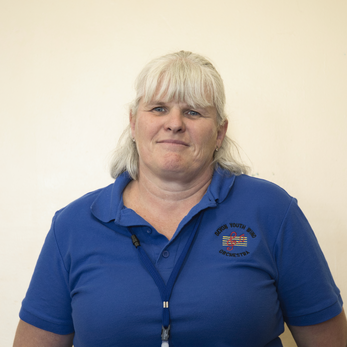
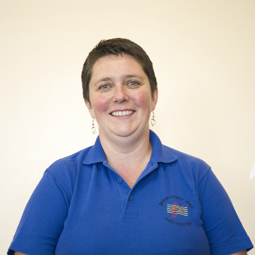

## Steve Grant – Musical Director
  
Steve started his musical career in the Band of Her Majesty’s Royal Marines. During his 25 years of service, he travelled extensively performing for Royalty and dignitaries. Highlights include being principal flautist on board HM Yacht Britannia during a Royal Tour of America and the Caribbean.  
Since retiring, Steve has worked as a conductor and music teacher in East Devon, volunteering for the East Devon Music Centre, forming its Saxophone Choir, and eventually becoming Musical Director of the Concert Band, Devon Youth Concert Orchestra (2 years), and Devon Youth Wind Orchestra (since 2006). Since 2009, he has also been Musical Director of the Exmouth Town Concert Band.

## Gill Preston – Chairperson

## Kate Grant – Secretary

## Laura Farrant – Treasurer

## Diane Hall – Committee Member

## Bev Brodbelt – Committee Member

## Lynda Henagulph – Committee Member

